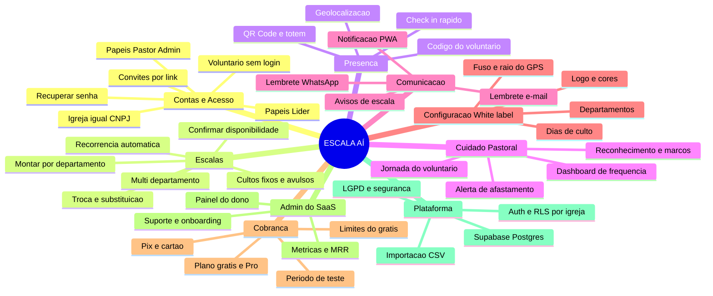
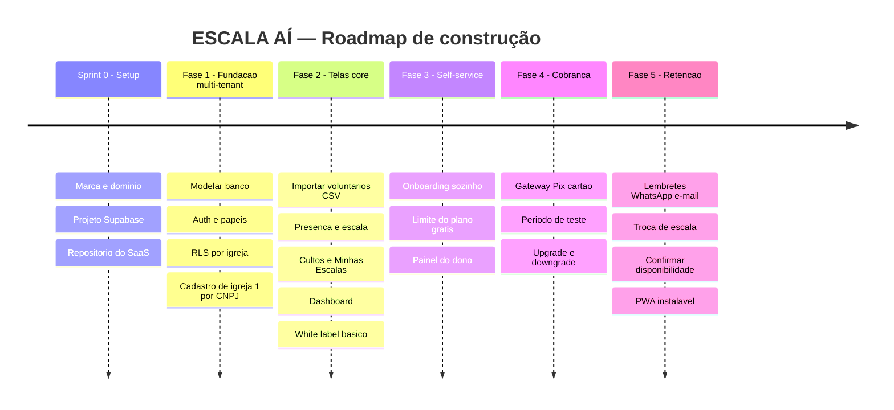

# ESCALA AÍ — Mindmap, Roadmap e Features (kickoff do SaaS)

> Companheiro do `PLANEJAMENTO.md` (que tem visão, ICP, preço e modelo de contas).
> Este aqui é o **mapa de execução**: o que construir, em que ordem e como começar.
> Documento vivo — vamos refinar tela a tela.

---

## 0. Status atual (jun/2026)

**Resumo:** Fase 1 ✅ concluída · Fase 2 ~90% (falta config da igreja/white-label
e papéis refinados). Já temos um **MVP funcional** ponta a ponta.

| Fase | Status |
|---|---|
| Sprint 0 — setup | 🟡 Supabase ✅ · codinome "Projeto Escala" ✅ · marca em verificação (**Diakun**) · repo ainda em subpasta |
| Fase 1 — fundação multi-tenant | ✅ **concluída** (auth, papéis, RLS, cadastro 1/CNPJ, isolamento testado) |
| Fase 2 — telas core | 🟢 **quase completa** (ver checklist) |
| Fase 3 — self-service/cobrança | ⬜ não iniciada |
| Fase 4 — cobrança | ⬜ não iniciada |
| Fase 5 — retenção | ⬜ não iniciada |

### Feito (Fase 2) ✅
- Departamentos (criar / renomear / excluir)
- Voluntários (multi-departamento) + edição
- Importação **CSV e XLSX** + **planilha modelo** para baixar
- Cultos fixos **por igreja** + Cultos do mês (gerar + avulsos)
- Montar escala (culto + departamento)
- **Presença do voluntário** (GPS, sem login) via RPC pública
- **Área do voluntário** (consultar minhas escalas)
- **Dashboard** completo: Geral · Por Culto · Departamento · Alertas + **PDF**
- Visual responsivo (celular e desktop)

### Falta para fechar a Fase 2 ⬜
- **Configuração da igreja (white-label):** logo, cores, **GPS + raio**, editar dados
- **Papéis refinados:** líder enxergar só o(s) seu(s) departamento(s) (hoje o acesso é no nível da igreja)
- **Convite de líder** por link

### Pendências paralelas
- **Marca:** decidir (Diakun em verificação no INPI/@)
- **Repositório:** mover de `comunidadeaava/projeto-escala` para repo próprio
- **Hospedagem:** publicar numa URL real (KingHost/Vercel) para usar no celular
- **AAVA (app atual):** KingHost estava fora do ar (rever quando voltar)

---

## 1. Mindmap do produto



---

## 2. Roadmap em fases

> Ritmo solo/meio-período. Sem datas rígidas — penso em **sprints** (≈2 semanas).
> A AAVA segue rodando a versão atual (Sheets) **sem parar** durante toda a migração.



### Detalhe das fases

| Fase | Objetivo | Entregas-chave | "Pronto" quando… |
|---|---|---|---|
| **Sprint 0** | Tirar do papel | Marca/domínio decididos, projeto Supabase criado, repo do SaaS, esqueleto do front | Consigo logar num "hello world" autenticado |
| **Fase 1 — Fundação** | Multi-tenant de verdade | Banco modelado, **Auth**, **papéis** (Pastor/Líder), **RLS** isolando por igreja, **cadastro de igreja (1/CNPJ)** | Duas igrejas de teste **não enxergam** dados uma da outra |
| **Fase 2 — Telas core** | Reaproveitar o que já temos | Importação **CSV** (o modelo que já criamos), presença, escala (multi-depto), cultos, Minhas Escalas, dashboard, **white-label básico** | Uma igreja consegue operar 1 mês inteiro |
| **Fase 3 — Self-service** | Crescer sem suporte manual | Onboarding guiado, **limite de 10 voluntários** no grátis, painel do dono | Igreja nova se cadastra e usa **sozinha** |
| **Fase 4 — Cobrança** | Receita | Gateway (Asaas/Mercado Pago) Pix+cartão, trial, upgrade automático | 1ª igreja **paga** dentro do app |
| **Fase 5 — Retenção** | Diferenciais que seguram | Lembretes WhatsApp/e-mail, **troca de escala** (#3 que adiamos), confirmar disponibilidade, PWA | Voluntário recebe aviso e confirma sozinho |

> **Estratégia de risco:** só investir pesado na Fase 2+ depois que a Fase 1 provar
> o isolamento de dados. Até a Fase 3, custo de infra ≈ R$ 0 (planos grátis).

---

## 3. Lista de features (priorizada — MoSCoW)

**M** = Must (MVP pago) · **S** = Should · **C** = Could · **W** = Won't (agora)

### Contas, acesso e segurança
| Feature | Prioridade | Fase |
|---|---|---|
| Cadastro de igreja com **CNPJ único** | **M** | 1 |
| Login Pastor/Admin e Líder (e-mail+senha) | **M** | 1 |
| Papéis e permissões (Admin vê tudo, Líder vê seu depto) | **M** | 1 |
| Isolamento de dados por igreja (**RLS**) | **M** | 1 |
| Voluntário **sem login** (só código) | **M** | 2 |
| Convite de líder por link | S | 3 |
| Recuperação de senha | S | 3 |
| Log de auditoria (quem mudou a escala) | C | 5 |

### Escalas e presença
| Feature | Prioridade | Fase |
|---|---|---|
| Montar/editar escala por departamento | **M** | 2 |
| **Multi-departamento** por voluntário | **M** | 2 |
| Cultos fixos + avulsos | **M** | 2 |
| Presença por código + **geolocalização** | **M** | 2 |
| "Minhas Escalas" do voluntário | **M** | 2 |
| Importar voluntários por **CSV** | **M** | 2 |
| QR Code / totem | S | 2 |
| **Recorrência** de escala (repetir padrão) | S | 5 |
| **Troca/substituição** de escala | S | 5 |
| Confirmar disponibilidade ("posso/não posso") | S | 5 |

### Cuidado pastoral (nosso diferencial)
| Feature | Prioridade | Fase |
|---|---|---|
| Dashboard de frequência (geral/culto/depto) | **M** | 2 |
| **Alerta de afastamento** (faltas seguidas) | **M** | 2 |
| Reconhecimento/marcos de presença | S | 2 |
| Exportar relatórios em **PDF** | S | 2 |
| Jornada do voluntário (linha do tempo) | C | 5 |

### Comunicação
| Feature | Prioridade | Fase |
|---|---|---|
| Lembrete por **e-mail** ("você está escalado") | S | 5 |
| Lembrete por **WhatsApp** | S | 5 |
| **PWA** instalável + push | C | 5 |

### White-label e configuração
| Feature | Prioridade | Fase |
|---|---|---|
| Logo e cores por igreja | **M** | 2 |
| Dias de culto configuráveis | **M** | 2 |
| Departamentos configuráveis | **M** | 2 |
| Fuso e raio do GPS por igreja | S | 2 |

### Cobrança e admin do SaaS
| Feature | Prioridade | Fase |
|---|---|---|
| Plano grátis (limite 10 voluntários) | **M** | 3 |
| Gateway Pix + cartão | **M** | 4 |
| Período de teste (trial) | **M** | 4 |
| Upgrade/downgrade automático | S | 4 |
| Painel do dono (igrejas/MRR/churn) | S | 3 |
| Central de ajuda / onboarding guiado | S | 3 |

---

## 4. Arquitetura multi-tenant (esboço do banco)

Stack: **Supabase (Postgres + Auth + RLS)** · frontend em Vercel/Cloudflare · cobrança Asaas/Mercado Pago.
A "chave" do isolamento é a coluna **`igreja_id`** em todas as tabelas + **RLS**.

```
igrejas        (id, cnpj UNICO, nome, logo, cor, fuso, gps_lat, gps_lng, raio_m, plano, criada_em)
usuarios       (id=auth.uid, igreja_id, nome, email, papel[admin|lider], criado_em)
departamentos  (id, igreja_id, nome, ativo)
voluntarios    (id, igreja_id, matricula, nome, status[ativo|inativo])
voluntario_dep (voluntario_id, departamento_id)        -- multi-departamento normalizado
cultos         (id, igreja_id, data, horario, descricao)
escalas        (id, igreja_id, culto_id, departamento_id)
escala_itens   (escala_id, voluntario_id)
registros      (id, igreja_id, voluntario_id, data, hora, escalado, lat, lng)  -- log puro
assinaturas    (id, igreja_id, plano, status, gateway_id, validade)
```

> **Ganho importante:** no banco real, o multi-departamento vira uma **tabela de
> ligação** (`voluntario_dep`) — mais limpo que o `;` da planilha. A importação CSV
> que já fizemos continua sendo a porta de entrada dos dados.

**Regra de ouro RLS:** toda query carrega o `igreja_id` do usuário logado; o Postgres
**bloqueia** qualquer linha de outra igreja. É isso que torna o "um amigo viu os dados"
(bug que corrigimos na v1) **impossível por construção**.

---

## 5. Como começar de fato — Sprint 0

1. **Fechar a marca + domínio** (ESCALA AÍ ou alternativo) → registrar `.com.br` e checar INPI.
2. **Criar o projeto no Supabase** (grátis) e o **repositório do SaaS**
   (recomendo **repo novo**, separado do app da AAVA, para não misturar produção com produto).
3. **Esqueleto do frontend** (React/Vite ou Next) com tela de login conectada ao Supabase Auth.
4. **Rodar o SQL do schema** acima + ativar **RLS** com 1 política por tabela.
5. **Smoke test multi-tenant:** criar 2 igrejas e provar que uma não vê a outra.

> A partir daí entramos na Fase 2 reaproveitando as telas atuais (presença, escala,
> dashboard) — o HTML/CSS/JS que já existe migra com pouca alteração; muda só "para
> onde as telas conversam" (Apps Script → Supabase).

### Decisões que preciso de você para o Sprint 0
- **Marca/domínio:** seguimos com ESCALA AÍ ou ainda em aberto?
- **Repositório:** repo novo dedicado ao SaaS (recomendo) ou pasta dentro deste?
- **Front:** posso escolher o stack (sugiro **Next.js + Supabase**), ou tem preferência?
- **Por onde começo a codar:** quer que eu já gere o **SQL do schema + as políticas RLS**
  (entrega concreta da Fase 1) para você criar no Supabase?
